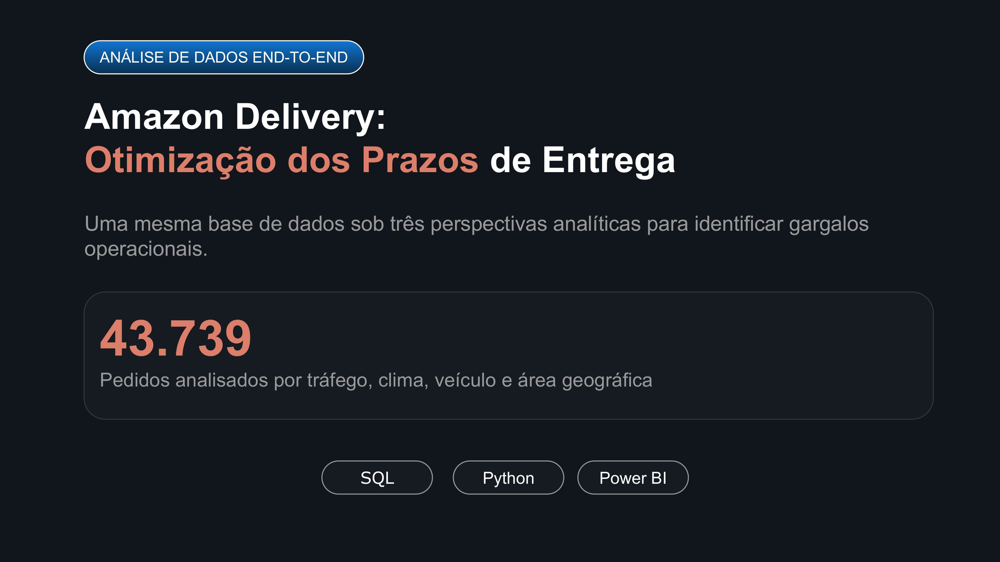
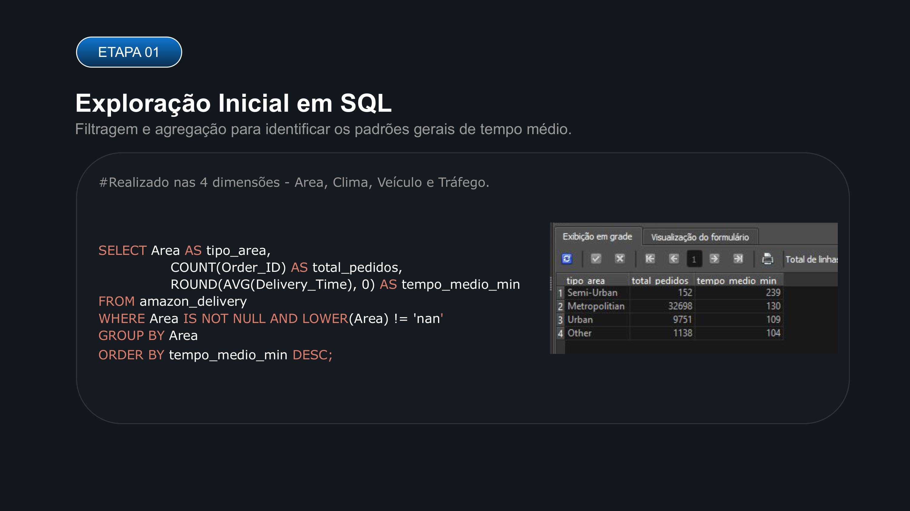
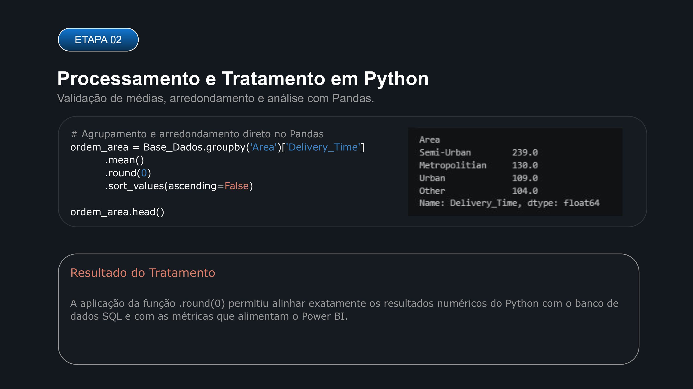
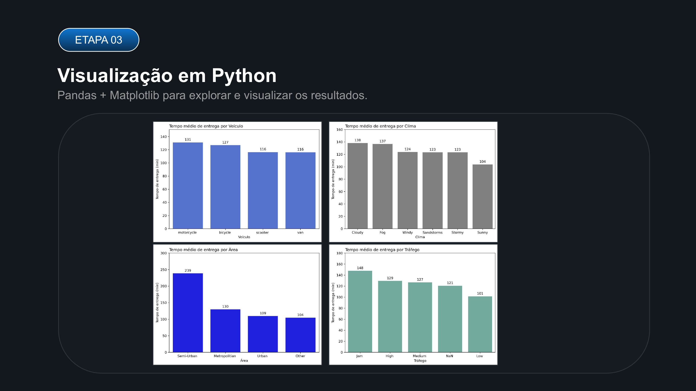
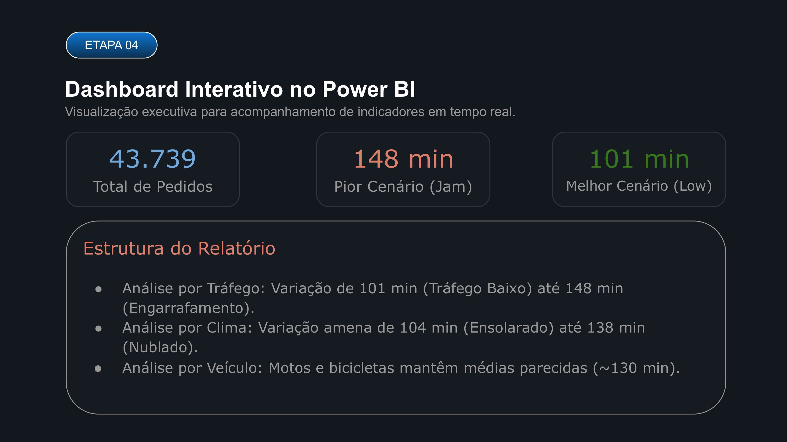
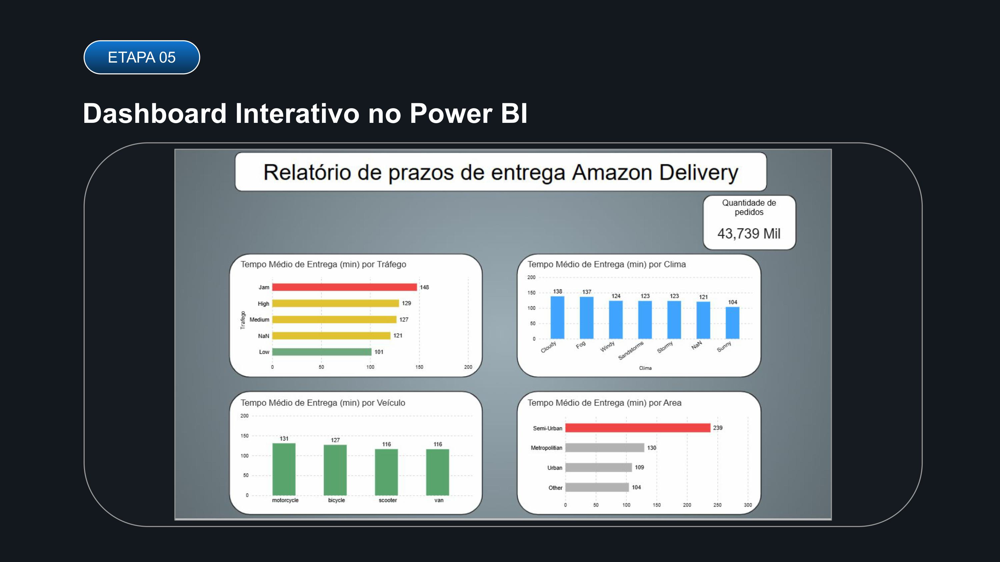
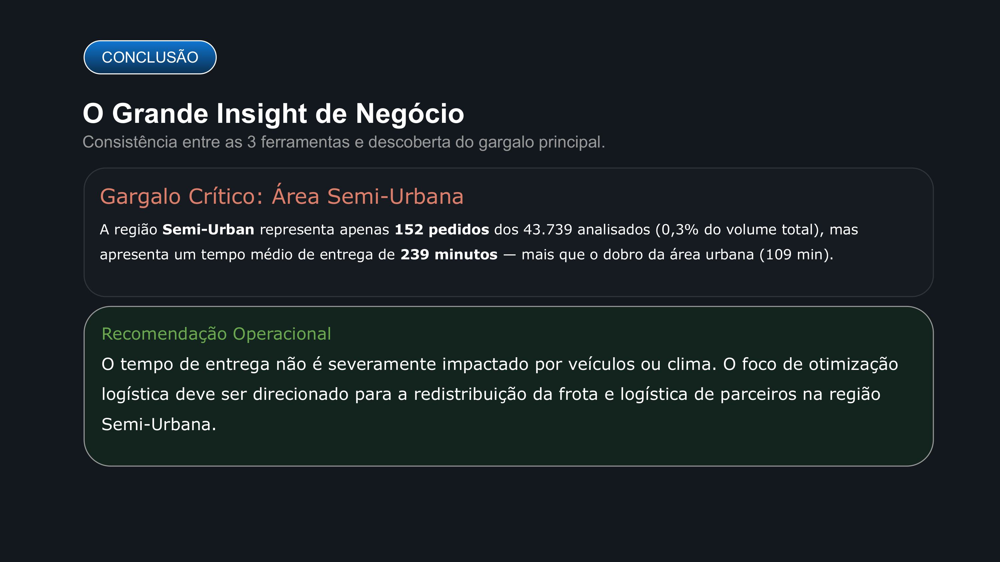

# Amazon Delivery: Otimização dos Prazos de Entrega

## 🎯 Contexto e Ação de Negócio
No setor de e-commerce e logística, a pontualidade na entrega é uma das métricas mais críticas para a experiência do cliente e a eficiência operacional. Neste projeto, realizei um estudo end-to-end sobre o dataset **Amazon Delivery**, analisando **43.739 pedidos** para diagnosticar gargalos operacionais e propor ações direcionadas para redução dos prazos de entrega.

A principal **ação de negócio** consistiu em avaliar o comportamento do **Fato - Prazo de Entrega** sob 4 dimensões (Clima, Tráfego, Área Geográfica e Veículo) em diferentes ferramentas analíticas para garantir total consistência dos dados e fundamentar tomadas de decisão estratégicas.

---

## 📸 Carrossel de Apresentação (Slides da Análise)

<b>🔍 Clique para expandir / recolher a apresentação visual do projeto</b>

 

  
    
  
    
  
    
  
    
  
    
  
    
  

---

## 💡 O Grande Insight de Negócio
- **Gargalo Crítico:** A região **Semi-Urbana (Semi-Urban)**. Embora represente apenas **152 pedidos (0,3% do volume total)**, apresenta um tempo médio de entrega de **239 minutos** — mais que o dobro do tempo registrado na área urbana (**109 min**).
- **Ação Recomendada:** O prazo de entrega não é significativamente afetado pelo tipo de veículo ou pelas condições climáticas. O foco principal da otimização logística deve ser a **redistribuição frotista e revisão da malha parceira na região Semi-Urbana**.

---

## 📊 Metodologia e Etapas da Análise

### 1. Fonte dos Dados
- **Origem:** Kaggle (Dataset: Amazon Delivery)
- **Volume:** 43.739 pedidos analisados.

### 2. Análise Exploratória (Google Sheets / Excel)
- Definição da métrica principal: `Fato - Prazo de Entrega` (`Delivery_Time`).
- Agrupamentos iniciais cruzando as 4 dimensões (`Clima`, `Tráfego`, `Área` e `Veículo`).

### 3. Dashboard Interativo (Power BI)
- Criação de relatório executivo com acompanhamento de KPIs em tempo real.
- **Métricas:** Total de Pedidos (43.739), Pior Cenário de Tráfego - Jam (148 min) e Melhor Cenário - Low (101 min).

### 4. Processamento e Visualização (Python)
- Scripts desenvolvidos com **Pandas** e **Matplotlib**.
- Aplicação do tratamento com `.round(0)` para alinhar numericamente os resultados entre o Python, SQL e Power BI.

### 5. Validação de Dados (SQLite)
- Importação da base para o **SQLite** e execução de queries agregadas (`GROUP BY`, `AVG`, `ROUND`) para confirmar a consistência em todas as ferramentas.

---

## 📈 Resultados Identificados por Dimensão

| Dimensão | Categoria / Filtro | Tempo Médio (min) |
| :--- | :--- | :--- |
| **Área** | Semi-Urban | **239** |
| | Metropolitan | 130 |
| | Urban | 109 |
| | Other | 104 |
| **Tráfego** | Jam (Engarrafamento) | **148** |
| | High | 129 |
| | Medium | 127 |
| | Low | **101** |
| **Clima** | Cloudy (Nublado) | 138 |
| | Fog (Nevoeiro) | 137 |
| | Sunny (Ensolarado) | **104** |
| **Veículo** | Motorcycle | 131 |
| | Bicycle | 127 |
| | Scooter / Van | 116 |

---

## 🔄 Consistência entre Ferramentas
Independentemente da ferramenta utilizada (Google Sheets, Power BI, Python ou SQLite), os cálculos e agrupamentos retornaram **exatamente os mesmos resultados**, comprovando a integridade dos dados e a precisão da pipeline analítica.
